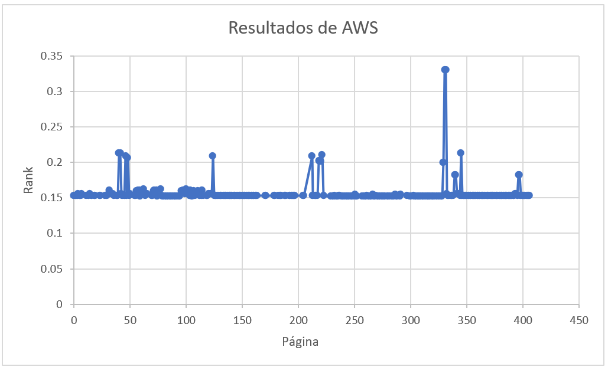

# PageRank usando EMR de AWS y Google Colab

[Ruben Huanca M.](https://github.com/RubenHuanca), Israel Pancca M.

04 Noviembre 2020

## 1. Problema

Uno de los problemas que se generan en alumnos de últimos años es obtener una fuente confiable de información, en vista a que hay muchos autores que tienen una línea de investigación, hay otros autores que comparten esa misma línea y eso se ve mediante las referencias en sus artículos.

## 2. Propuesta

Nuestra propuesta es utilizar el pageRank como herramienta para estudiantes que puedan obtener autores con una línea de investigación muy referenciada mediante el rank obtenido por el algoritmo PageRank. Además darles a conocer una alternativa gratuita como Google Colab, para los que no puedan acceder a un clúster de cualquier nube.

### 2.1 Scrappy

Para generar la data utilizamos la herramienta \textit{lynx + cURL} que es utlizada para extraer información o URLs que contengan la url que se ingresa. En nuestro caso utilizamos la extracción de urls hasta el tercer nivel de la siguiente página [Greg Brockman](https://paperswithcode.com/author/greg-brockman) que contiene la vista de un autor de una página de que comparte papers con código, en el resultado obtuvimos un total de :

- Primer nivel: **1** link que es la página ingresada.
- Segundo nivel: **17** links de la página padre.
- Tercer nivel: **390** links de los hijos del nivel 2.

Haciendo un total de **408** links únicos(nodos) y un total de **567** aristas entre los nodos.
Para poder ver el gráfo generado de nuestro scrappy esta en el siguiente enlace
[Gráfo](scrappy/grafoLinks.pdf)

### 2.2 PageRank

Es un algoritmo utilizado para asignar de forma numérica la relevancia de los documentos (o páginas web) indexados por un motor de búsqueda.

## 3. Resultados

Comparativa de PageRank usando EMR de AWS y Google Colab usando un grafo de 408 páginas y 567 aristas.

### Tiempo de ejecución de PageRank usando EMR de AWS y Google Colab
|              |      Recursos       | Características  | #Tiempo (seg) |
| :----------: | :-----------------: | :--------------: | :-----------: |
|  EMR de AWS  | 1 master y 2 slaves | 4 CPU, 16 GB RAM |      46       |
| Google Colab |      1 master       |   12.72 GB RAM   |      56       |

A continuación mostraremos los resultados de los Ranks obtenidos de las 408 páginas

<!--  -->

# 4. Conclusión
Gracias al algoritmo PageRank se pudo obtener que página tiene mayor relevancia, además el Framework Spark aceleró los resultados obtenidos; obteniendo una diferencia de tiempo de aproximadamente de 18 por ciento en el uso de Google Colab. Es una diferencia que se podría aceptar, si uno no puede pagar un cluster en una nube.

## 5. Source

Los códigos del desarrollo lo pueden ver en la carpeta [code](code) donde estarán los 2 códigos:

- [Código para Google colab](code/pagerank_colab_SaveRDD.py)
- [Código para EMR AWS](code/pagerank_sparkOriSave.py)

# 6. Referencias
- APACHE Spark. Examples. [Online]. Available: http://spark.apache.org/examples.html (Accessed: 03-Nov-2020)
- Wikipedia. PageRank. [En línea]. Disponible en: https://es.wikipedia.org/wiki/PageRank (Accessed: 03-Nov-2020)
- Web Scraping with lynx + cURL. Disponible en: https://siliconheaven.info/webscraping-curl-lynx/#gsc.tab=0 (Accessed: 03-Nov-2020)
- Google Colab. [Online]. Available: https://colab.research.google.com/ (Accessed: 03-Nov-2020)
- AWS. Elastic MapReduce. [Online]. Available: https://aws.amazon.com/emr/ (Accessed: 03-Nov-2020)
- Mining of Massive Datasets. The 3rd edition of the book. [Online]. Available: http://mmds.org/ (Accessed: 03-Nov-2020)
- Breadth First Search or BFS for a Graph. Python3. [Online]. Available: https://www.geeksforgeeks.org/breadth-first-search-or-bfs-for-a-graph/ (Accessed: 03-Nov-2020)
