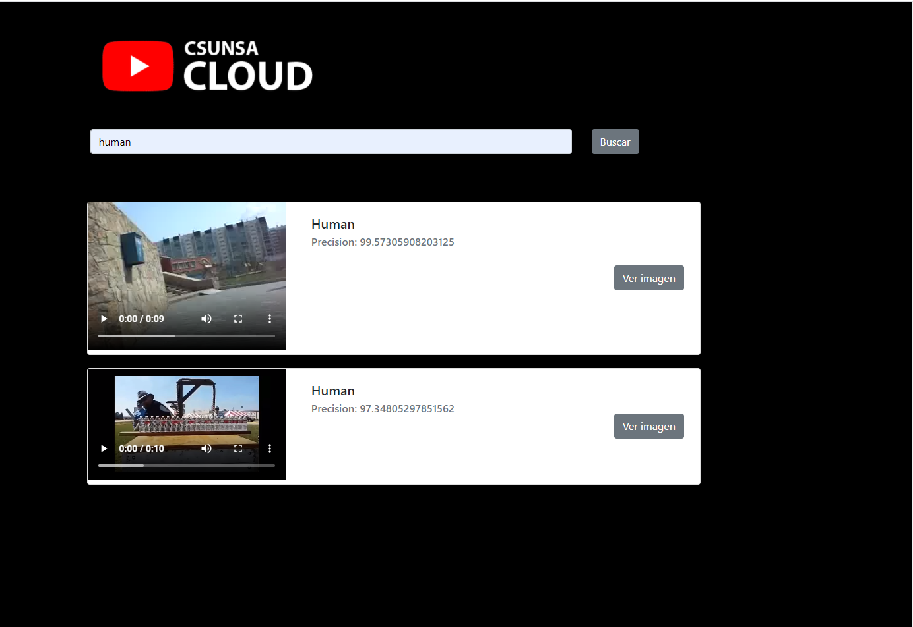
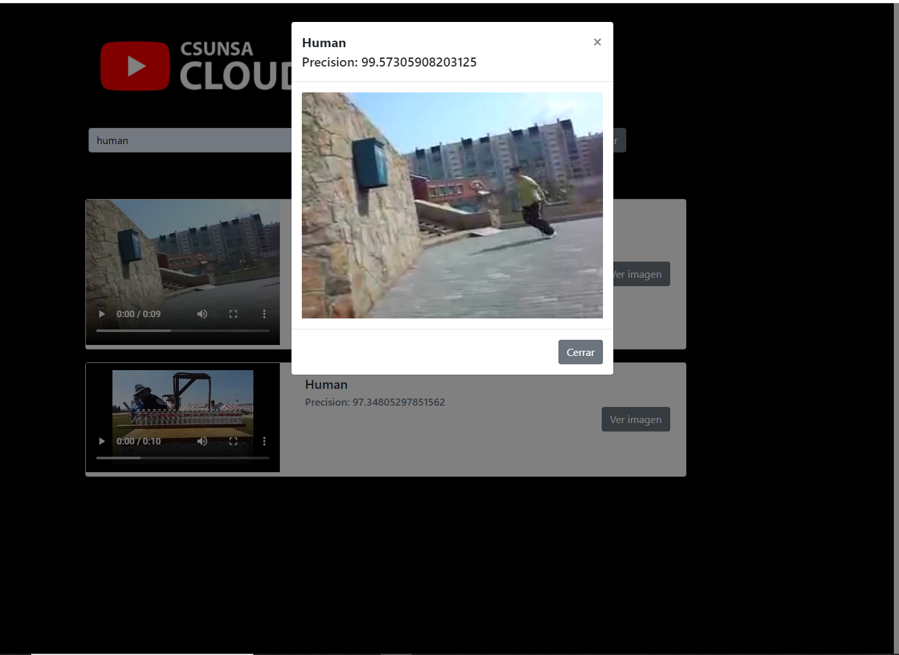

# TRABAJO FINAL DEL CURSO DE CLOUD COMPUTING
El proyecto fue desarrollado por: 

[Jefferson Poma](https://github.com/st4rck19981), [Ruben Huanca](https://github.com/RubenHuanca) y [Israel Pancca](https://github.com/fnixTiago)

## Video Processing Pipeline en AWS
Se implementó algoritmos en AWS para la búsqueda de objetos en vídeos. Para ello eso utilizó los diferentes servicios de AWS como S3, Lambda, FFmpeg, Rekognition, DynamoDB y CloudSearch. la búsqueda toma una cadena (etiqueta) y devuelve una lista de vídeos en donde se encontró dicha cadena, indicando el segundo en que aparece.

## Resultados de la página web
Para poder ejecutar el proyecto debe seguir los siguientes pasos.

Se utilizo ReactJS

Para la instalación:
### `npm install`

Para la ejecución del código: 
### `npm start`

Las siguientes imágenes son el resultado del proyecto en ejecución.

